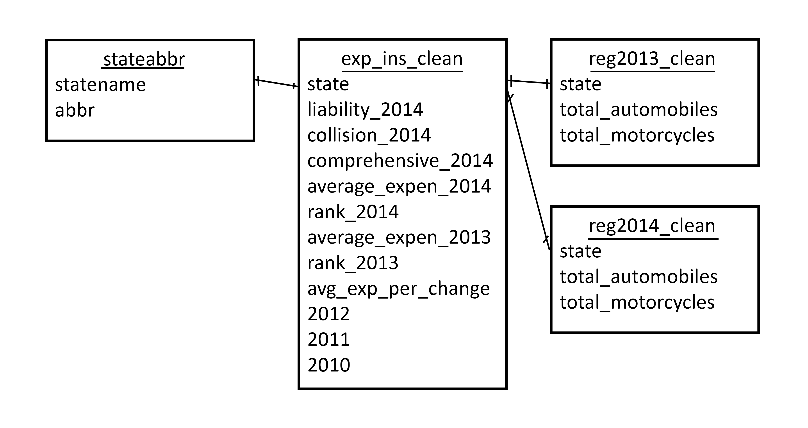

```{r setup, include=FALSE}
library(tidyverse)
library(data.world)
library(shiny)
knitr::opts_chunk$set(echo = TRUE)
```

## Github Link

Click [here to view Team 3's Github](https://github.com/omar-olivarez/F17eDVProject5).

## Data.world Project Link
Click [here to view Team 3's Data.world Final Project Link](https://data.world/omarolivarez/f-17-edv-project-5).

## What are we working on? An introduction to our project

This notebook will detail all the steps involved with visualizing data, including the Data Science pipeline. 

## What's this data? A description of the Expenditure Insurance dataset

The dataset used for all these examples is data regarding vehicle insurance expenditure, census data on how people get to work, vehicle registration numbers and general census data for each state in the United States.

Take a look at our Data model below to understand how the tables we're working with are linked together:


## Inputting the data and cleaning it 
Let's first import the dataset as a csv from the hard disk and clean the columns so that they are in integers and decimals rather than characters. Click on the 'Code' button to see that we used the 'read_csv' function to read the 'expenditure-insurance.csv' file from the hard disk of the user 'Carlos'. [CARLOS I ASSUME YOU HAVE THIS CODE]
```{r}
# place cleaning code here
```
Now the columns in the dataframe are either integers (for example: year) or strings (for example: state). Click on the 'Code' button above. You can see that our team exported the new file 'exp_ins_clean.csv' to the hard disk of the same user 'Carlos'. After this step, our team loaded the cleaned csv into data.world for the proceeding steps in the Data Science Pipeline process. 

## Importing cleaned data from data.world
Now let's use the data.world library to import the [Expenditure Insurance dataset](https://data.world/omarolivarez/f-17-edv-project-5/workspace/file?filename=exp_ins_clean.csv) from data.world: [THIS IS NOT THE CORRECT LINK]
```{r}
project <- "https://data.world/omarolivarez/f-17-edv-project-5"
data.world::set_config(cfg_env("DW_API"))
df <- data.world::query(data.world::qry_sql("SELECT * FROM exp_ins_clean"), dataset = project) %>% dplyr::select(1:12)
```
Let us take a look at the dataset's column names to see which visualizations work best for the data types:
```{r}
names(df)
```
## Crime Rates Decrease, But Proportions Remain the Same (Line Graph)

### Evaluating average expenditure based on number of collisions (in future, maybe per capita) 
Click on the 'Code' button below to see our code. First, we selected the columns for states' name, collisions in 2014, and average expenditures in 2014. 

We created a scatter plot of average expenditure and number of collisions in 2014, with each point representing the data for one state in the United States. Below we can see our findings.
**Notice the positive trend between the two variables. However, one interesting thing to note is that Oregon and California have similar average insurance expenditures in 2014, despite the fact that California had 72% more collisions than Oregon did in 2014. This is the largest discrepancy between any states with similar expenditure levels. We will examine this phenomena further**
*(The red points represent Oregon on the left and California on the right)*
```{r}
renderPlot({ 
  df2 <- df %>% dplyr::select(collision_2014, average_expenditure_2014, state) 
  g1 <- subset(df2, state == "Oregon")
  g2 <- subset(df2, state == "California")
  ggplot() + geom_point(mapping = aes(x=collision_2014,y= average_expenditure_2014), data = df2) + geom_point(mapping = aes(x = collision_2014, y = average_expenditure_2014), colour="red", size=3, data=g1) + geom_point(mapping = aes(x = collision_2014, y = average_expenditure_2014), colour="red", size=3, data=g2)
  })

myColors <- c("red4", "darkslategray3", "dodgerblue1", "darkcyan","gray79", "black", "skyblue2", "dodgerblue4","purple4", "maroon", "chocolate1", "bisque3", "bisque","seagreen4", "lightgreen", "skyblue4", "mediumpurple3","palevioletred1", "lightsalmon4", "darkgoldenrod1")

```
 
